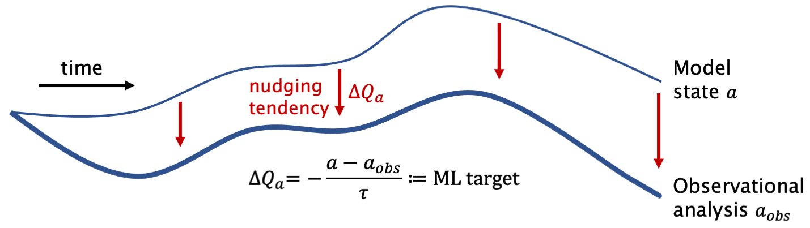
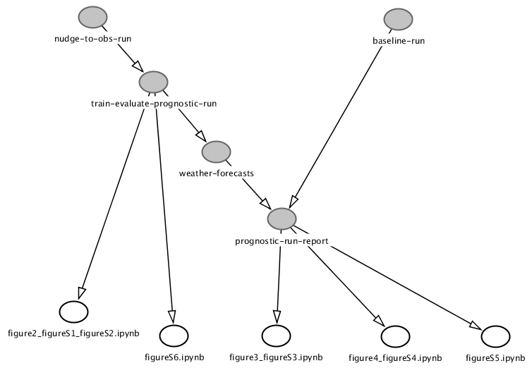

[](https://doi.org/10.5281/zenodo.4667727)

# nudge-to-obs-manuscript-workflow
Code and configuration to generate the data and figures in Watt-Meyer et al. (2021) "Correcting weather and climate models by machine learning nudged historical simulations".


Figure 1 of Watt-Meyer et al. (2021).

## Overview
This repository consolidates and archives the code used to generate the results in Watt-Meyer et al. (2021) in one place. This may be helpful for readers of that manuscript to understand the tools used and details of the method. However, it is not expected that the code here will be easily executed by external users since it uses specific cloud computing resources provisioned for the Vulcan Climate Modeling group. See [fv3gfs-wrapper](https://github.com/VulcanClimateModeling/fv3gfs-wrapper) for a public-facing python-wrapper of the FV3GFS atmospheric model.

The source code and workflow definitions are contained within the `fv3net` submodule. The configuration and submission scripts for the workflows are in `workflow` and `notebooks` contains Jupyter notebooks which generate all of the figures for the manuscript.

## Repository tree
```
├── LICENSE
├── Makefile                                Rules to submit workflows
├── README.md
├── dag.png
├── dag.txt
├── fv3net                                  Submodule of fv3net repository
├── install_kustomize.sh
├── notebooks                               Jupyter notebooks to generate manuscript figures
│   ├── figure1.png
│   ├── figure2_figureS1_figureS7.ipynb
│   ├── figure3_figureS2.ipynb
│   ├── figure4_figureS3.ipynb
│   ├── figureS4.ipynb
│   ├── figureS5.ipynb
│   ├── figureS6.ipynb
│   └── how-active-is-humidity-limiter.ipynb
└── workflow                                Configuration of workflows
    ├── baseline-run                        Year-long FV3GFS run with no ML
    ├── kustomization.yaml                  Specify Docker image tags to use
    ├── nudge-to-obs-run                    Two-year nudged FV3GFS run
    ├── offline-report-on-training-data     Compute offline skill on training data
    ├── prognostic-run-report               Evaluate prognostic runs and generate report
    ├── train-evaluate-prognostic-run       Train ML models, evaluate offline, do year-long prognostic runs
    └── weather-forecasts                   10-day forecasts with baseline, ML-corrected FV3GFS
```

## Dependencies

The workflows used by this repository are written with [argo](https://argoproj.github.io/projects/argo) (argo v2.11.6 was used) and are designed to run on a [Kubernetes](https://kubernetes.io) cluster. The workflows do disparate things such as run the FV3GFS model, train machine learning models and compute diagnostics related to the performance of the ML models and FV3GFS simulations. They all output data to the Vulcan Climate Modeling group's Google Cloud Storage.

The notebooks generate figures for the manuscript using the output on Google Cloud Storage from the argo workflows. The notebooks assume the `fv3net` python environment is active. This can be installed by calling `make create_environment`.

## Directed Acyclic Graph (DAG)

Dependencies of various workflows (grey ovals) and notebooks (white ovals):


